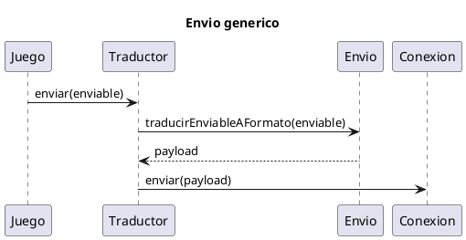
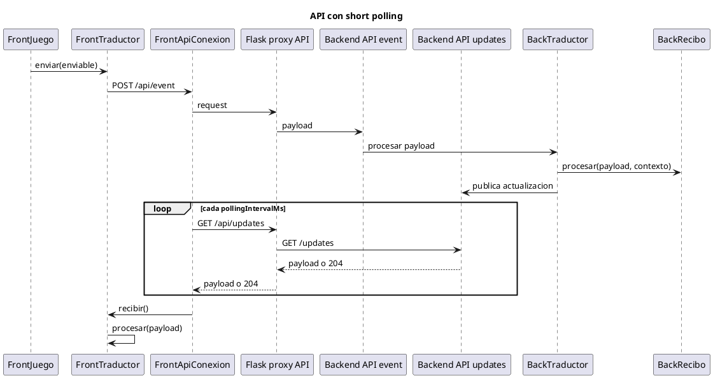
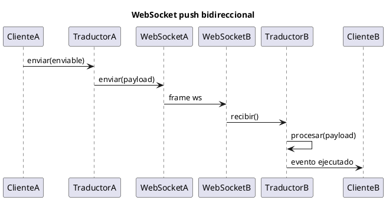
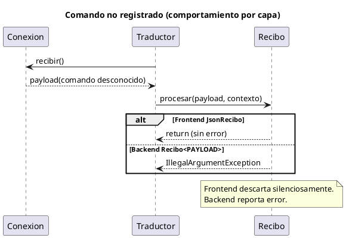
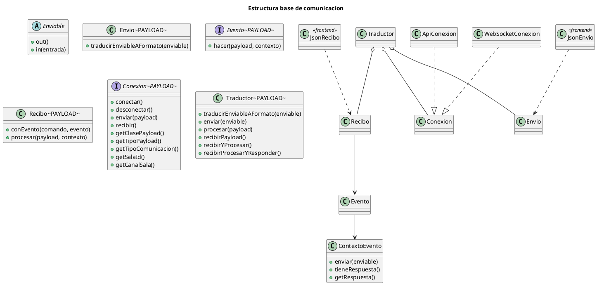

## Arquitectura de comunicacion (version actual)

Este documento describe la arquitectura de comunicacion backend/frontend, incluyendo el comportamiento real de API con short polling y WebSocket push.

## 1. Principio general

La arquitectura separa tres responsabilidades:

1. Lógica de dominio del juego.
2. Traducción entre objetos de dominio y payload de transporte.
3. Transporte físico (API, WebSocket, gRPC, etc.).

Con esto, el juego no depende del canal y el canal no depende de reglas de negocio.

Nota de estado actual:

1. En backend, Envio<PAYLOAD> y Recibo<PAYLOAD> son clases concretas genericas.
2. En frontend, se mantiene el modelo Envio/Recibo con implementaciones JsonEnvio/JsonRecibo.

## 2. Componentes

### 2.1 Enviable

Mensaje de dominio intercambiable entre backend y frontend. Cada clase concreta define out() e in(...).

### 2.2 Envio

Convierte un Enviable a payload de transporte.

Estado actual:

1. Backend: clase concreta Envio<PAYLOAD> con funcion traductora y factory Envio.paraStringDesdeOut().
2. Frontend: implementacion JsonEnvio para payload json-string.

### 2.3 Evento<PAYLOAD>

Define la lógica de un comando entrante mediante hacer(payload, contexto). El evento puede o no producir respuesta.

### 2.4 ContextoEvento

Permite publicar la respuesta principal sin acoplarse al transporte: contexto.enviar(enviable).

Estado actual:

1. Solo permite una respuesta principal por evento.
2. Expone tieneRespuesta()/getRespuesta() para que Traductor decida si serializa y envia.

### 2.5 Recibo<PAYLOAD>

Dispatcher de entrada por comando (Strategy):

1. Mantiene un diccionario comando -> evento.
2. Se construye de forma inmutable con conEvento(...).
3. En procesar(payload, contexto), extrae comando y ejecuta evento.

Politica actual por capa:

1. Backend Recibo<PAYLOAD>: si el comando no existe, lanza error.
2. Frontend JsonRecibo: si el comando no existe, descarta silenciosamente.

### 2.6 Conexion<PAYLOAD>

Transporta payloads, expone tipo de comunicacion (API, WEBSOCKET, etc.) y metadatos de sala:

1. getSalaId()
2. getCanalSala()

### 2.7 Traductor<PAYLOAD>

Orquesta Envio + Recibo + Conexion y valida compatibilidad de payload.

Metodos principales:

1. traducirEnviableAFormato(enviable)
2. enviar(enviable)
3. procesar(payload)
4. recibirPayload()
5. recibirYProcesar()
6. recibirProcesarYResponder()

### 2.8 Configuracion externa de transporte

Backend usa configuracion externa para rutas, host y puertos en:

1. config/comunicacion-runtime.properties

Incluye, entre otros:

1. api.endpoint.salaTemplate
2. api.endpoint.actualizaciones.salaTemplate
3. ws.canal.salaTemplate
4. api/ws host y puertos

## 3. Comportamiento por canal

### 3.1 API (request/response + short polling)

En la implementacion actual se usan dos patrones:

1. Patron generico por sala (ApiConexion): endpoint de eventos + endpoint de actualizaciones por sala.
2. Patron de juego via proxy Flask (Space Invaders):
1. POST /api/event para entrada.
2. GET /api/updates para salida con short polling (playerId/screenId).

Flujo real esperado:

1. Front envia comando con Traductor.enviar(...).
2. Backend procesa el evento correspondiente.
3. Si el backend genera actualizacion de negocio, la publica en el canal de salida.
4. Front recibe esa actualizacion en polling periodico y la encola en Conexion.
5. Traductor del front consume recibir() y ejecuta Recibo.procesar(...).

### 3.2 WebSocket (push bidireccional)

En WebSocket no hay polling:

1. Cualquier extremo envia por conexion abierta.
2. El receptor encola y procesa con Traductor + Recibo.
3. La respuesta puede ser:
1. Automatica con recibirProcesarYResponder().
2. Explicita cuando el evento/servicio decida emitir un mensaje posterior.

Implementacion actual destacada:

1. Prueba WebSocket usa canales urlJugadores/urlPantalla entregados por backend.
2. La sincronizacion entre ventanas del juego pasa por backend (no hay canal directo ventana a ventana para estado de juego).

## 4. Flujos de procesamiento

### 4.1 Envio

1. Juego crea Enviable.
2. Llama a Traductor.enviar(...).
3. Envio traduce a payload.
4. Conexion transmite payload.

### 4.2 Recepcion con respuesta de negocio

1. Conexion entrega payload a Traductor.
2. Traductor llama a Recibo.procesar(payload, contexto).
3. Evento.hacer(...) ejecuta logica.
4. Evento llama contexto.enviar(enviableRespuesta).
5. Traductor serializa y envia la respuesta.

### 4.3 Recepcion sin respuesta de negocio

Mismo flujo, pero el evento no llama a contexto.enviar(...).

### 4.4 Recepcion de comando no registrado

Politica actual por capa:

1. Backend Recibo<PAYLOAD>: error por comando no registrado.
2. Frontend JsonRecibo: descarta silenciosamente y no interrumpe el bucle de recepcion.

## 5. Flujo de trabajo para un juego nuevo

### 5.1 Crear Enviables

1. Definir mensajes de dominio.
2. Implementar out() e in(...).

### 5.2 Crear Eventos

1. Crear una clase por comando (Evento<PAYLOAD>).
2. Implementar hacer(payload, contexto).
3. Parsear/validar payload y delegar a metodos tipados.
4. Usar contexto.enviar(...) solo cuando haya respuesta de negocio.

### 5.3 Registrar Eventos en Recibo

1. Crear Recibo (por ejemplo Recibo.paraJsonString() en backend o JsonRecibo en frontend).
2. Registrar comandos con conEvento("COMANDO", evento).

### 5.4 Montar Traductor

1. Elegir Conexion (ApiConexion o WebSocketConexion).
2. Elegir Envio segun capa:
1. Backend: Envio.paraStringDesdeOut() o Envio<PAYLOAD> custom.
2. Frontend: JsonEnvio u otro.
3. Configurar Recibo segun capa:
1. Backend: Recibo.paraJsonString() + conEvento(...).
2. Frontend: JsonRecibo + conEvento(...).
4. Construir Traductor(conexion, envio, recibo).

### 5.5 Definir loop de entrada

1. API: conectar() inicia polling y el juego consume con recibirYProcesar() o recibirProcesarYResponder().
2. WebSocket: consumir mensajes entrantes por conexion abierta con los mismos metodos de Traductor.

## 6. Diagramas de secuencia (PlantUML)

### 6.1 Envio generico

### 6.2 API con short polling

### 6.3 WebSocket push bidireccional

### 6.4 Comando no registrado (comportamiento por capa)

## 7. Diagrama de clases (PlantUML)

